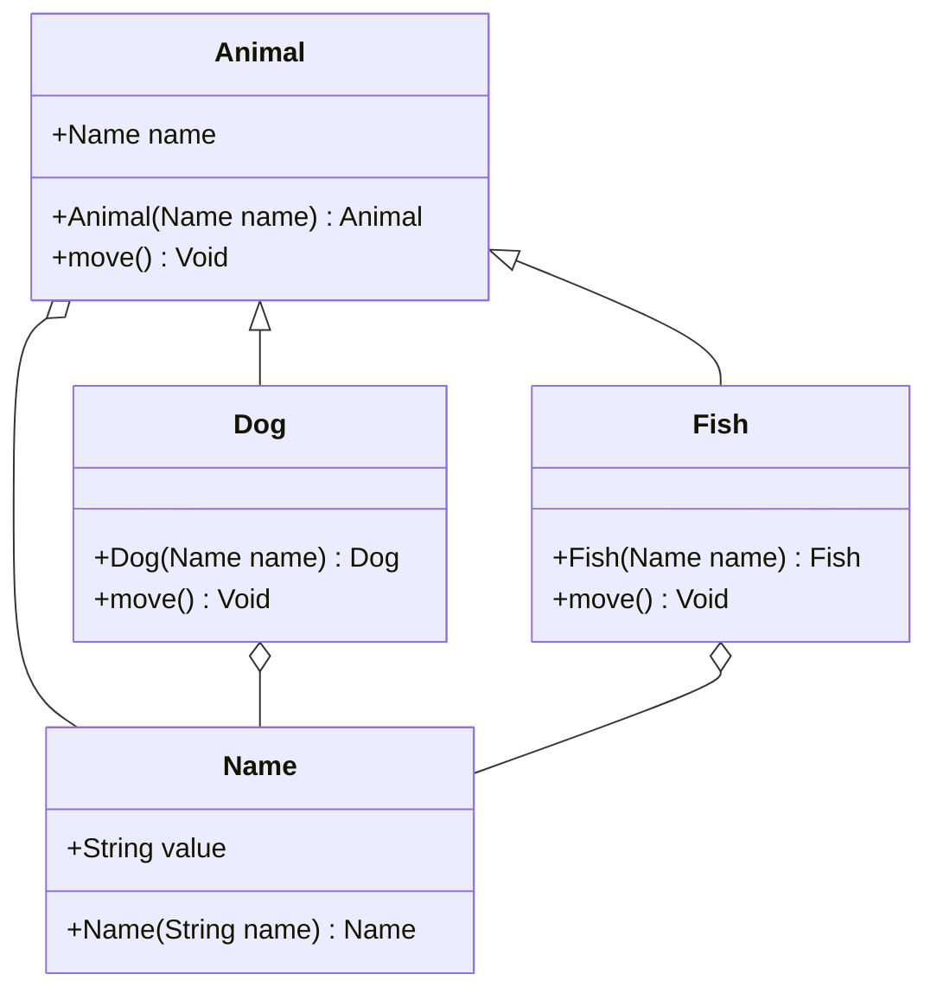

# PSDiagramGenerator

# Introduction

PSDiagramGenerator is a diagram generator for PowerShell scripts. The available feature is to generate UML class diagrams for [`mermaid`](https://mermaid-js.github.io/mermaid/#/) and [`PlantUML`](https://plantuml.com/).

# Usage

```powershell
New-MermaidClassDiagram [-Path]

New-PlantUMLClassDiagram [-Path]
```

# Installation

This module has a dependency on [PSClassUtils](https://github.com/Stephanevg/PSClassUtils) powershell module. The module is installed automatically.

```powershell
Install-Module -Name PSDiagramGenerator
```

# Functions

## New-MermaidClassDiagram

### Functionality

Generate a class diagram for mermaid from PowerShell class syntax. Source code of the class diagram is copied to the clipboard.

### Example

The markdown code is copied to the clipboard by following function.

```powershell
New-MermaidClassDiagram -Path ./example/Animal.psm1
```

````

````


If the classes exist in multiple files, use the cmdlet like following. 

```powershell
New-MermaidClassDiagram -Path (Get-Item -Path ./*.psm1)
```

## New-PlantUMLClassDiagram

### Functionality

Generate a class diagram for PlantUML from PowerShell class syntax. Source code of the class diagram is copied to clipboard.

### Example

The plantuml code is copied to the clipboard by following function.

```powershell
New-PlantUMLClassDiagram -Path ./example/Animal.psm1
```

```
@startuml

Animal o-- Name
Animal <|-- Dog
Dog o-- Name
Animal <|-- Fish
Fish o-- Name

class Animal {
  +Name name

  +Animal(Name name) Animal
  +move() Void
}

class Name {
  +String value

  +Name(String name) Name
}

class Dog {

  +Dog(Name name) Dog
  +move() Void
}

class Fish {

  +Fish(Name name) Fish
  +move() Void
}

@enduml
```


If the classes exist in multiple files, use the cmdlet like following. 

```powershell
New-PlantUMLClassDiagram -Path (Get-Item -Path ./*.psm1)
```

## TBD

Generate other diagrams.
