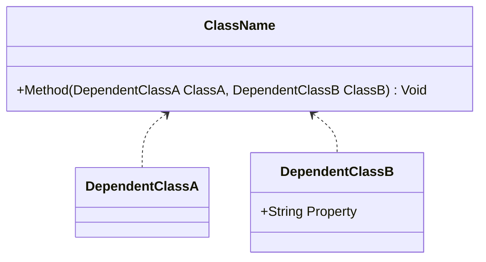

```mermaid
classDiagram

ClassName <.. DependentClassA
ClassName <.. DependentClassB

class ClassName {

  +Method(DependentClassA ClassA, DependentClassB ClassB) Void
}

class DependentClassB {
  +String Property

}

```