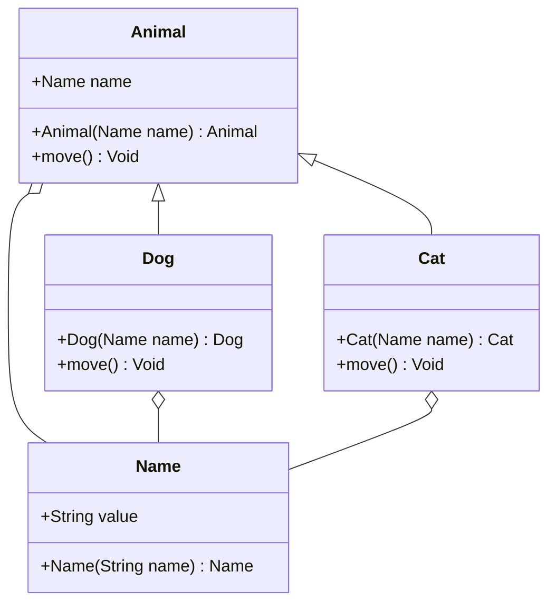

```mermaid
classDiagram

Animal o-- Name
Animal <|-- Dog
Dog o-- Name
Animal <|-- Cat
Cat o-- Name

class Animal {
  +Name name

  +Animal(Name name) Animal
  +move() Void
}

class Dog {

  +Dog(Name name) Dog
  +move() Void
}

class Cat {

  +Cat(Name name) Cat
  +move() Void
}

class Name {
  +String value

  +Name(String name) Name
}

```